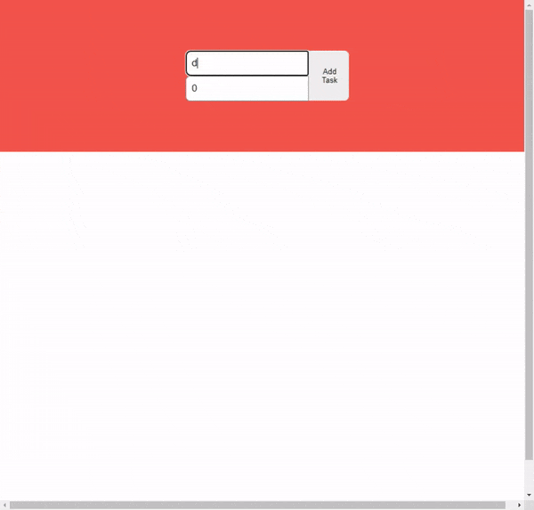

<h1 align="center">
  
</h1>

<h1 align="center">
  
</h1>

## 📚 About

A **todo app** created using typeScript and vite initializer

---

## 🛠 Technologies

- [React](https://reactjs.org/)
- [TypeScript](https://www.typescriptlang.org/)
- [Vite](https://vitejs.dev/)

---

## 💾 How to use in your local machine

```bash
  # clone repository
  $ git clone https://github.com/Egnoel/React-TypeScript-Todo
  # enter directory
  $ cd React-TypeScript-Todo
  # install dependencies
  $ npm install
  # start project
  $ npm run dev
```